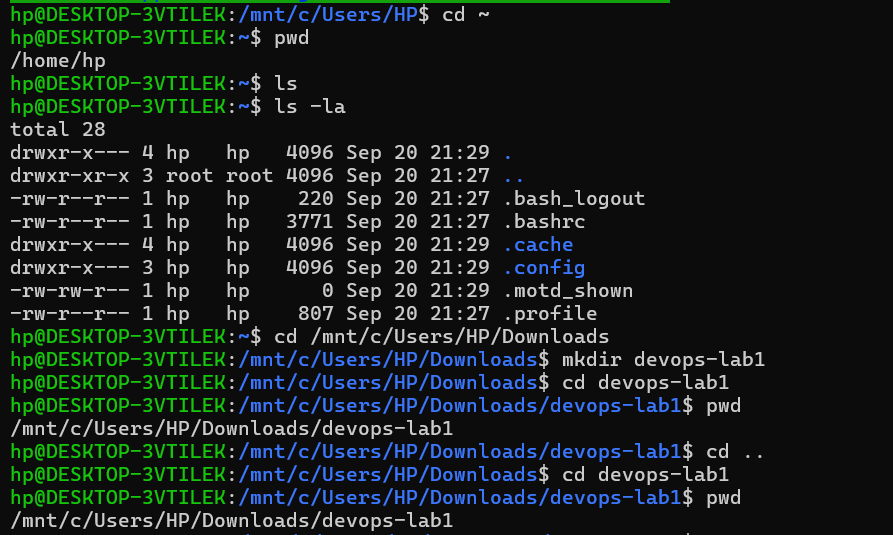
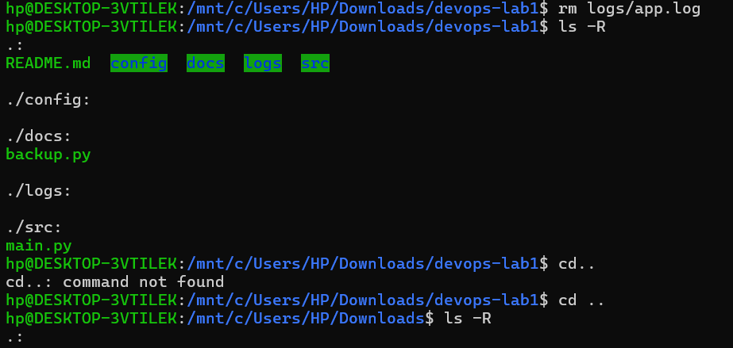
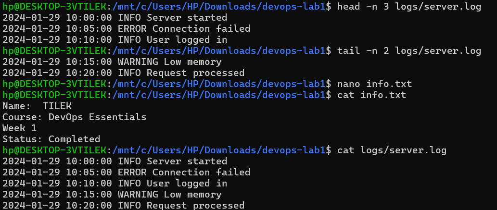
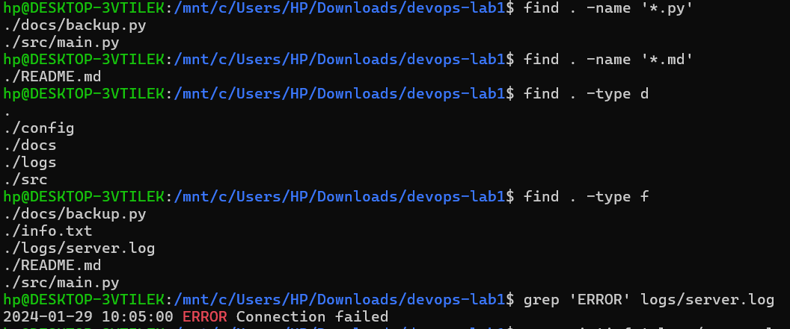
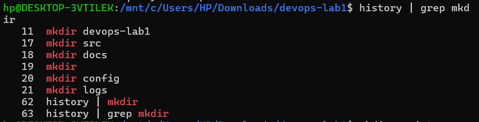
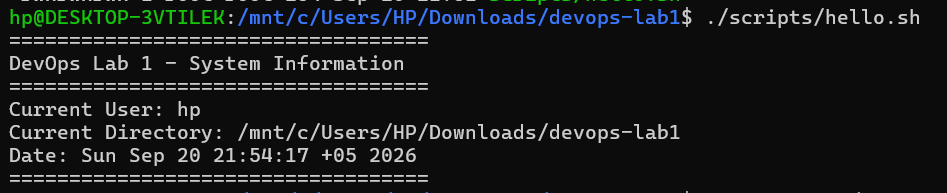
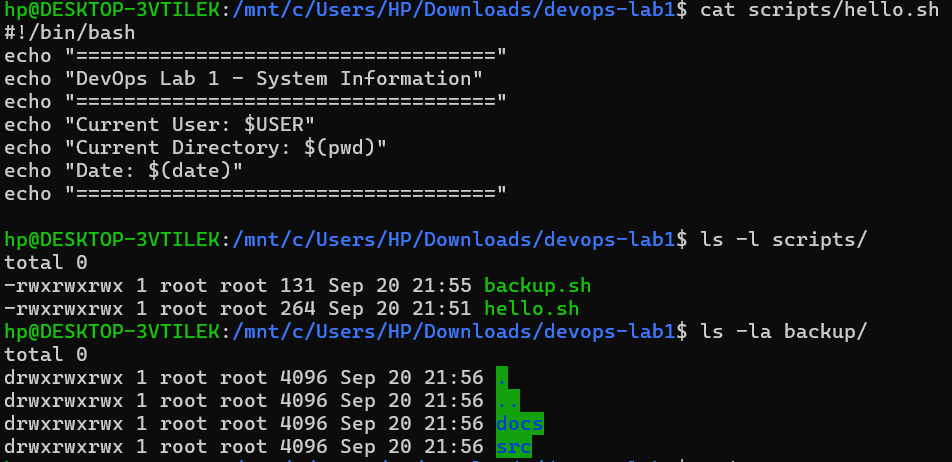

# DevOps Lab 1 - Linux CLI
**Student:** Tilek
**Group:** COMCEH24
**Date:** 20/09/2026
## Task 1: Navigation
✓ Completed

## Task 2: File Management
✓ Completed

## Task 3: Working with Content
✓ Completed

## Task 4: Search
✓ Completed

## Task 5: Bash Scripts
✓ Completed

## Difficulties
Similarities in commands and remembering the commands.
## What You Learned
Finding files, words in files, lines. Redacting text using nano. Working with a file, while in a different directory.
